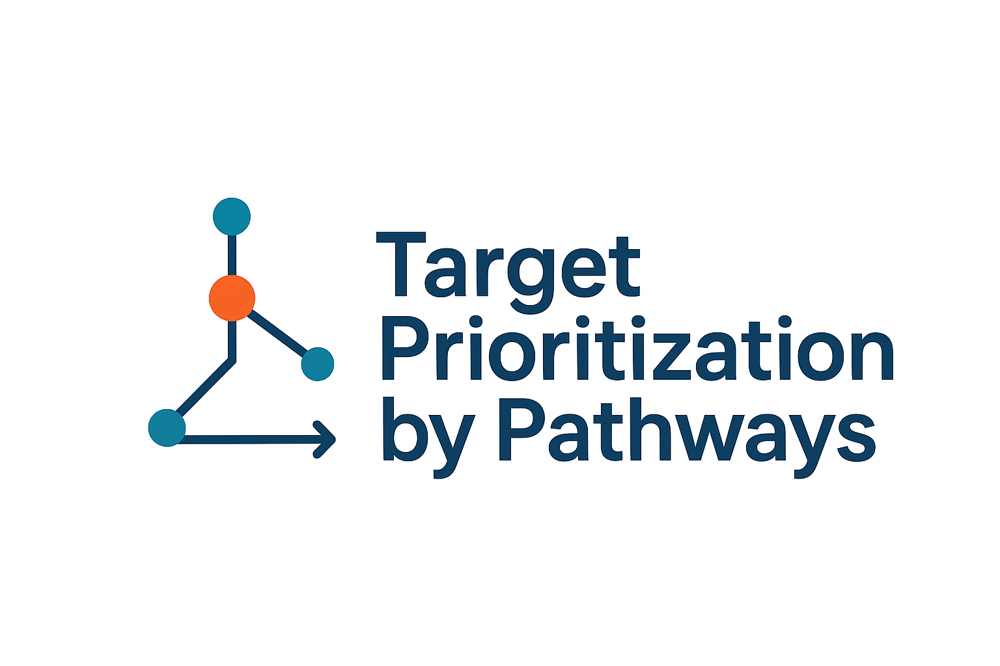
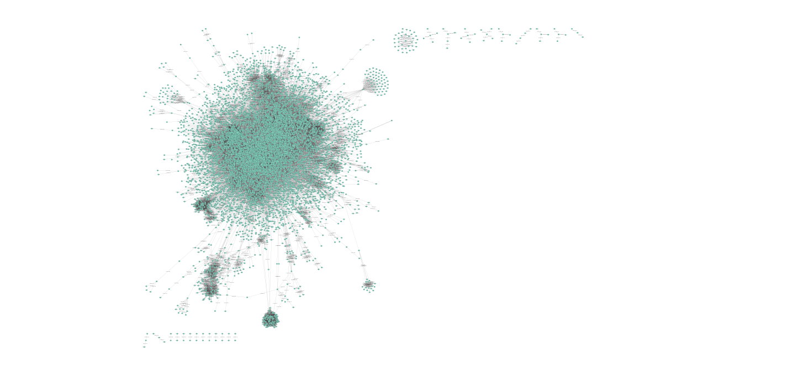

> Open Targets Hackathon, October 21-22, 2025


<h1 align="left">Project #18: Target prioritisation by pathways </h1>

<p align="center">
  
</p>


The aim of the project was to develop a disease-specific pathway assessment tool. We built a bioinformatics workflow that uses an associated target and disease-specific biological pathways to find novel targets implicated in disease. This tool can help researchers understand the biological pathways underlying disease and identify novel intervention points considering both efficacy and safety profiles along with target tractability. Here we present a prototype developed during the hackathon.


## Contributors
- Jędrzej Kubica (jedrzej.kubica@univ-grenoble-alpes.fr)
- Polina Rusina (polina@ebi.ac.uk)
- Siddharth Sethi (sidharth.sethi@astx.com)
- Elvis Poku-Adusei (elvispokkad@yahoo.com)


## Introdution


### TODO Initial plan:
- validate_input(gene_symbol:str, disease_name:str)
   - Validate and fetch gene ensembl_id and disease EFO_id
- get_genes_associated_with_disease(disease_efo_id, data_source=None, score_threshold=None)
- execute_gsea()
- get_pathways_for_gene(ensembl_ids:List[str])
- get_genes_for_pathway(pathway_id:List[str])
- create_gene_matrix(ensembl_ids:List[str], pathway_ids:List[str])
- GSEA
- find all genes that are both disease-specific and on the same pathways as target
- prioritze targets (network propagation? anothe scoring formula?)
- parse reactome interactions and map new targets to pathways, visualize


## How to use this repo

```
git clone git@github.com:jedrzejkubica/targets-from-pathways.git
cd targets-from-pathways
```

Prepare input data and run the pipeline as described below. See results in scores.tsv.

### Dependencies and environment

Set up a Python 3.10+ environment and install dependencies:

```
pip install --upgrade pip
pip install pandas blitzgsea networkx pyarrow
```

Notes:
- You can use `fastparquet` instead of `pyarrow`: `pip install fastparquet`.
- blitzgsea: https://github.com/MaayanLab/blitzgsea

### Required data (updated)

Place files under `data/` unless noted.

- Open Targets associations parquet (required)
  - Directory: `data/association_by_datatype_indirect/`
  - Columns needed: `diseaseId`, `targetId`, `score` (optional: `datatypeId`).
  - Source: Open Targets Platform release (e.g., 25.09) association by datasource indirect export.

- Open Targets targets parquet (recommended)
  - Directory: `data/target/`
  - Columns: `id`, `approvedSymbol`. Used to map Ensembl IDs to gene symbols.
  - If missing, mapping falls back to Reactome mapping; otherwise to `data/gene_data.txt`.

- Reactome files (for the final overlap/scoring step)
  - Mapping file (8-column TSV; includes `Homo sapiens` rows):
    - `data/Ensembl2Reactome_PE_All_Levels.txt`
    - Download:
      ```
      curl -L -o data/Ensembl2Reactome_PE_All_Levels.txt \
        https://download.reactome.org/94/Ensembl2Reactome_PE_All_Levels.txt
      ```
  - Functional interactions:
    - `data/FIsInGene_04142025_with_annotations.txt` (from zip)
    - Download and unzip:
      ```
      curl -L -o data/FIsInGene_04142025_with_annotations.txt.zip \
        http://cpws.reactome.org/caBigR3WebApp2025/FIsInGene_04142025_with_annotations.txt.zip
      unzip -o data/FIsInGene_04142025_with_annotations.txt.zip -d data
      ```
  - The `run.py` script can auto-download both if you pass `--auto_fetch` and use these default filenames.

- Reactome GMT for GSEA (required)
  - Place a `.gmt` file under `gsea/Reactome_2025/` or use an absolute path.

- Optional helper maps
  - `data/gene_data.txt` two-column TSV `gene_name<TAB>ensembl_id` (fallback mapping)
  - `data/disease_data.txt` two-column TSV `disease_name<TAB>efo_id` (only needed if using disease names instead of EFO IDs)

### Step-by-step usage (updated)

Create an experiment folder (recommended):
```
mkdir -p experiments/my_experiment
```

1) Build GSEA input from Open Targets associations (prefer EFO directly)
```
python -m functions.sid \
  --disease_id EFO_0004248 \
  --datatype genetic_association \
  --output experiments/my_experiment/final_gsea_input.tsv
```
Options (functions/sid.py):
- `--disease_id EFO_...` (preferred) or `--disease_name "..."`
- `--datatype` optional (e.g., `genetic_association`)
- `--gene_name` optional (validated; not used to compute the input)

2) Run GSEA and filter pathway IDs
```
python gsea/run_gsea.py \
  experiments/my_experiment/final_gsea_input.tsv \
  gsea/Reactome_2025/<your_file>.gmt \
  --output experiments/my_experiment/gsea_results.tsv \
  --output-ids experiments/my_experiment/gsea_ids.tsv \
  --fdr-threshold 0.05 \
  --nes-positive
```
Options (gsea/run_gsea.py):
- `--pval-threshold` optional (e.g., `0.01`)
- `--fdr-threshold` optional (e.g., `0.05`)
- `--nes-positive` optional (require NES > 0)

3) Reactome overlap/scoring
```
python run.py \
  --pathway_mapping_file data/Ensembl2Reactome_PE_All_Levels.txt \
  --interactions_file data/FIsInGene_04142025_with_annotations.txt \
  --target ESR1 \
  --gsea_ids_file experiments/my_experiment/gsea_ids.tsv \
  --auto_fetch \
  1>experiments/my_experiment/scores.tsv
```
Options (run.py):
- `--gsea_ids_file` optional (defaults to legacy hardcoded path if omitted)
- `--auto_fetch` optional (auto-downloads Reactome files if missing and default filenames used)
- `--target` is required for this step

### End-to-end (single command)

```
GMT="gsea/Reactome_2025/<your_file>.gmt"
python main_script.py \
  --disease_id EFO_0004248 \
  --datatype genetic_association \
  --gene_name ESR1 \
  --gmt_file "$GMT" \
  --experiment_dir experiments/my_experiment \
  --fdr_threshold 0.05 --nes_positive \
  --run_reactome --auto_fetch \
  --pathway_mapping_file data/Ensembl2Reactome_PE_All_Levels.txt \
  --interactions_file data/FIsInGene_04142025_with_annotations.txt
```
Outputs (in `experiments/my_experiment/`):
- `final_gsea_input.tsv` (symbol, globalScore)
- `gsea_results.tsv`
- `gsea_ids.tsv` (filtered pathway IDs)
- `scores.tsv` (overlap/scoring)


## Methods

We introduced a new methodology for target prioritization. The user inputs a disease and a target of interest (perhaps the medication for this target doesn't work). First, we get a gene list for the disease from Open Targets Platform (Associations - indirect (by data source) ; http://ftp.ebi.ac.uk/pub/databases/opentargets/platform/25.09/output/association_by_datasource_indirect) and perform GSEA using the blitzgsea Python package (https://github.com/MaayanLab/blitzgsea). We obtain pathways associated with the disease. Second, we find also all pathways with the target on it also using Reactome database (gene-to-pathway mapping ; https://download.reactome.org/94/Ensembl2Reactome_PE_All_Levels.txt). That's how we get pathways associated with the disease and the target and we find all genes that are on these pathways. The, we prioritize these genes as new potential targets for the disease by:
- scoring using pathway selectivity (formula below)
- scoring using network propagation (Random Walk with Restart, MutliXrank (Baptista et al, 2020) ; https://github.com/anthbapt/multixrank)
Finally, we obtain a list of scored genes, the higher the score, the more likely it is to be associated with the disease and the target (based on pathways only).

### Flowchart


### Data

See the updated "Required data" section above for current inputs and exact download commands.


### Run pipeline

See the updated "Step-by-step usage" and "End-to-end" sections above.

## Results

Here are top 10 genes based on pathway selectivity (using BTG4 as target as example):

| Gene   | Score |
|--------|--------|
| TUBB4B | 0.76   |
| RPS2   | 0.72   |
| POLR2D | 0.68   |
| PABPC1 | 0.68   |
| EIF4G1 | 0.68   |
| EIF4E  | 0.68   |
| EIF4B  | 0.68   |
| EIF4A2 | 0.68   |
| EIF4A1 | 0.68   |
| BIRC5  | 0.68   |
| ZP2    | 0.64   |


Reactome functional interaction network:


Here are top 10 genes based on network propagation (using target + disease genes as seeds):


## Future directions

Short-term:
- refine and test the pathway selectivity scoring formula
- finalize and assess network propagation with Reactome functional interaction network (interactions_reactome.tsv)
- get insights about scoring of new targets + interpretability
- assess the method's performance, compare with similar methodologies

Long-term:
- adapt for other target types (genes, proteins, miRNA)
- identify drug repurposing opportunities
- effect of target knockout within the network
- given a desired effect (inhibition, activation) recommend top drugs
- use efficy and safety (Open Targets Pharmacovigilance)
- integrate pipeline within Open Targets Platform (https://platform.opentargets.org/)


## Python environment

See "Dependencies and environment" above for required packages. Tools like multixrank may be used for future network propagation experiments (optional).


## Special thank you to the Organizers of the Open Targets Hackathon!


## References
1. Wu, G., Feng, X. & Stein, L. A human functional protein interaction network and its application to cancer data analysis. Genome Biol 11, R53 (2010). https://doi.org/10.1186/gb-2010-11-5-r53
2. Baptista, A., Gonzalez, A. & Baudot, A. Universal multilayer network exploration by random walk with restart. Commun Phys 5, 170 (2022). https://doi.org/10.1038/s42005-022-00937-9
