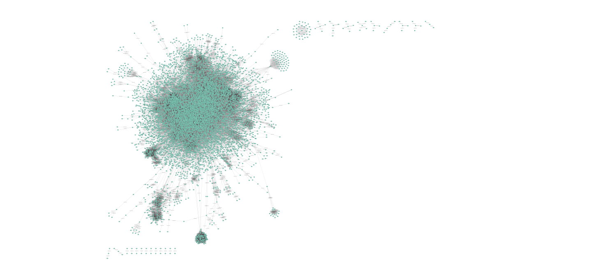

> Open Targets Hackathon, October 21-22, 2025

# Project #18: Target prioritisation by pathways

The aim of the project was to develop a disease-specific pathway assessment tool. We built a bioinformatics workflow that uses an associated target to find disease-specific biological pathways and identify novel targets implicated in disease. This tool can help researchers understand the biological pathways underlying disease and identify novel intervention points considering both efficacy and safety profiles along with target tractability. Here we present a prototype developed during the hackathon.


## Contributors
- Jędrzej Kubica (jedrzej.kubica@univ-grenoble-alpes.fr)
- Siddharth Sethi (sidharth.sethi@astx.com)
- Polina
- Elvis


## Introdution


### TODO Initial plan:
- validate_input(gene_symbol:str, disease_name:str)
   - Validate and fetch gene ensembl_id and disease EFO_id
- get_genes_associated_with_disease(disease_efo_id, data_source=None, score_threshold=None)
- execute_gsea()
- get_pathways_for_gene(ensembl_ids:List[str])
- get_genes_for_pathway(pathway_id:List[str])
- create_gene_matrix(ensembl_ids:List[str], pathway_ids:List[str])
- GSEA
- parse reactome interactions
- find all genes that are both disease-specific and on the same pathways as target
- visualize
- prioritze targets (network propagation?)


## How to use this repo

```
git clone git@github.com:jedrzejkubica/targets-from-pathways.git
cd targets-from-pathways
```

Prepare input data and run the pipeline as described below. See results in scores.tsv.


## Methods

### Flowchart

### Data

Please, put all data files in a directory called data/

> **_Note:_** All data files below are just test files with minimal data for our example target genes and disease

- Gene metadata (gene_symbol, ensembl_id)  
  This [file](data/gene_data.txt) serves as a mapping between gene symbols and their corresponding Ensembl IDs. It also helps to validate user input for gene symbols. The genes selected in this file are the top 5 genes associated with male infertility sorted by Chembl score. These genes would be used as input genes for our example.

- Disease metadata (disease_name, disease_efo_id,)  
  This [file](data/disease_data.txt) serves as a mapping between disease names and their corresponding EFO IDs. It also helps to validate user input for disease names.

- Disease association by data source (disease_efo_id, ensembl_id, data_source, association_score)  
  This [file](data/disease_association_data.txt) contains associations between diseases and genes, along with the data source and association score. It is used to fetch genes associated with a specific disease based on user-defined criteria.

- Reactome pathway data from OT (pathway_id, pathway_name, ensembl_id)
- Reactome pathway gene set from REACTOME
- Reactome pathway interactions file

Reactome gene-to-pathway mapping file:
```
wget https://download.reactome.org/94/Ensembl2Reactome_PE_All_Levels.txt
```

Reactome functional interaction file (see Wu et al., 2010):
```
wget http://cpws.reactome.org/caBigR3WebApp2025/FIsInGene_04142025_with_annotations.txt.zip
```


### Software

Part 1:

Use Pathway Targets Extractor (https://github.com/MaayanLab/blitzgsea), a Python module for Gene Set Enrichment Analysis, to extract pathway-target gene pairs.


Part 2:

main_script.py demonstrates how our final script should work. Please populate the remaining pipeline in the main script as required.

```
python main_script.py --gene_name="SLC22A11" --disease_name="male infertility"
```

Part 3:

Parse Reactome gene-to-pathway mapping, outputs genes that are both disease-specific and on the same pathways as target (using "BTG4" for now as example)

```
python run.py --pathway_mapping_file data/Ensembl2Reactome_PE_All_Levels.txt --interactions_file data/FIsInGene_04142025_with_annotations.txt 1>scores.tsv
```

For every gene found in the overlap between disease-specific and target-specific list:

score = (number of disease pathways containing the gene + number of target pathways containing the gene) / (total disease pathways + total target pathways)


## Results

Here are top 10 genes we got in our study, using BTG4 as target:

| Gene   | Score |
|--------|--------|
| TUBB4B | 0.76   |
| RPS2   | 0.72   |
| POLR2D | 0.68   |
| PABPC1 | 0.68   |
| EIF4G1 | 0.68   |
| EIF4E  | 0.68   |
| EIF4B  | 0.68   |
| EIF4A2 | 0.68   |
| EIF4A1 | 0.68   |
| BIRC5  | 0.68   |
| ZP2    | 0.64   |


Reactome functional interaction network:



## Future directions

- refine scoring formula


## Python environment

required packages: networkx, pandas


## References
1. Wu, G., Feng, X. & Stein, L. A human functional protein interaction network and its application to cancer data analysis. Genome Biol 11, R53 (2010). https://doi.org/10.1186/gb-2010-11-5-r53