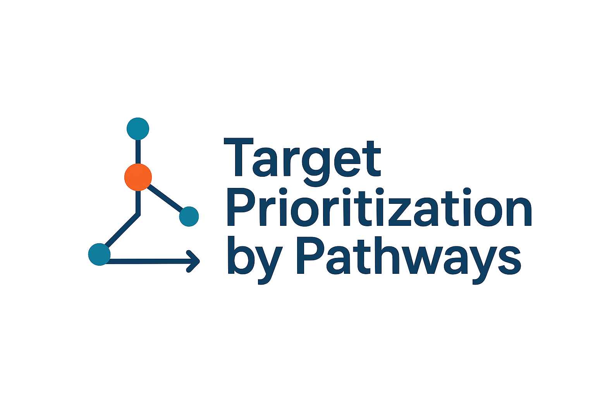

> Open Targets Hackathon, October 21-22, 2025


<h1 align="left">Project #18: Target prioritization by pathways </h1>

<p align="center">
  
</p>


The aim of the project was to develop a disease-specific and pathway-based target assessment tool. We built a bioinformatics workflow that uses a target of interest and disease-specific biological pathways to find alternative targets for treatments. This tool can help researchers understand biological pathways underlying disease and identify promising intervention points considering both efficacy and safety profiles along with target tractability.


## Contributors
- Jędrzej Kubica (jedrzej.kubica@univ-grenoble-alpes.fr)
- Polina Rusina (polina@ebi.ac.uk)
- Siddharth Sethi (sidharth.sethi@astx.com)
- Elvis Poku-Adusei (elvispokkad@yahoo.com)


## Introdution

We celebrated a decade of the Open Targets Platform (https://platform.opentargets.org/) for drug target identification and prioritisation at the Open Targets Hackathon on October 21-22, 2025. We imagined a scenario where a researcher is investigating a patient for whom the therapy acting on a specific target is failing. This necessitates finding alternative or compensatory targets that would make the treatment effective.

Biological pathways are rich source of information for such a study, therefore we aimed to add an additional line of evidence for the identification of alternative targets based only on pathways.

The pipeline begins by retrieving genes that are already associated with the disease from the Open Targets Platform. We it performs Gene Set Enrichment Analysis (GSEA) to identify pathways relevant to the disease. From these pathways, it retrieves all genes to define a broader disease-associated pathway context. At the same time, it extracts all genes involved in the pathways that have the target of interest. It then finds the intersection of disease- and pathway-specific genes, which represents alternative target candidates that can function within the same molecular processes and disease. These candidates are prioritised using a scoring strategy.


## Methods

We introduced a new methodology for target prioritization based only on biological pathways. The user provides a disease and a target of interest. First, the pipeline finds disease-associated genes using the Open Targets Platform (https://platform.opentargets.org/) and performs Gene Set Enrichment Analysis (GSEA) using the blitzgsea Python package (https://github.com/MaayanLab/blitzgsea). Genes are prioritezed using pathway selectivity formula (described below) and network propagation (Random Walk with Restart, MutliXrank (Baptista et al, 2020) ; https://github.com/anthbapt/multixrank). The output is a ranking of genes, where the higher the score, the more likely the gene is going to serve as alternative treatment.


### Flowchart


## How to use this repo

```
git clone git@github.com:jedrzejkubica/targets-from-pathways.git
cd targets-from-pathways
```

### Data

Prepare input data and run the pipeline as described below. We assume that all files are downloaded into `data/`.

```
mkdir data
```

- Open Targets associations parquets, source: Open Targets Platform (Associations - indirect (by data source))
  ```
  wget --recursive --no-parent --no-host-directories --cut-dirs 6 ftp://ftp.ebi.ac.uk/pub/databases/opentargets/platform/25.09/output/association_by_datasource_indirect .
  ```

- Open Targets targets parquets, source: Open Targets Platform (Target)
  ```
  wget --recursive --no-parent --no-host-directories --cut-dirs 6 ftp://ftp.ebi.ac.uk/pub/databases/opentargets/platform/25.09/output/target .
  ```

- ReactomePathways.gmt file, source: https://reactome.org/download/current/
  ```
  wget https://reactome.org/download/current/ReactomePathways.gmt.zip
  unzip ReactomePathways.gmt.zip
  ```

- Reactome gene-to-pathway mapping file, source: https://reactome.org/download-data
  ```
  wget https://download.reactome.org/94/Ensembl2Reactome_PE_All_Levels.txt
  ```
  
- Reactome functional interactions (described in Wu et al., 2010), source: https://reactome.org/download-data
  ```
  wget http://cpws.reactome.org/caBigR3WebApp2025/FIsInGene_04142025_with_annotations.txt.zip
  unzip FIsInGene_04142025_with_annotations.txt.zip
  ```


### Run pipeline

In the instructions below we use an example: rheumatic disease (EFO_0005755) and PTGS2 as the target of interest.

1) Gene Set Enrichment Analysis (GSEA): Find pathways associated with the disease

```
python gsea/run_gsea.py \
  --target_parquets_dir data/target/ \
  --associations_parquets_dir data/association_by_datasource_indirect/ \
  --disease EFO_0005755 \
  --datatype genetic_association \
  --gmt_file data/ReactomePathways_merged.gmt \
  --pval_threshold 0.05 \
  --fdr_threshold 1 \
  1>disease_pathways.txt
```

NOTE: `--pval_threshold` and `--fdr_threshold` are user-specified parameters for filtering GSEA results based on statistical significance. Only results with a p-value less <= threshold are kept. Only results with FDR <= threshold are kept.

2) Pathway-based scoring: 

For each gene the score is calculated as follows:

`score = (#disease pathways containing the gene + #target pathways containing the gene) / (total number of disease pathways + total number of target pathways)`

Pathway selectivity scores genes based on how frequently they occur in both pathways associated with the disease and the specified target. 

```
python reactome/run_reactome.py \
  --pathway_mapping_file data/Ensembl2Reactome_PE_All_Levels.txt \
  --disease_pathways_file disease_pathways.txt \
  --target PTGS2 \
  1>scores.tsv
```

3) (WIP) Network propagation scoring:
```
cd network_propagation
```

Build a Reactome functional interaction network:
```
python parse_interactions.py --interactions_file ../data/FIsInGene_04142025_with_annotations.txt 1>interactions_reactome.tsv
```

Before running MultiXrank:
- create seeds.txt: one target per line (e.g., disease genes)
- modify config.yml as specified in https://github.com/anthbapt/multixrank

run MultiXrank:
```
python run_multixrank.py
```
The scores will be saved to: output/multiplex_1.tsv


## Results

Part 1. Pathway-based scoring

We found 250 disease-specific pathways for rheumatic disease (EFO_0005755). We found 3259 genes that are both disease-specific and on the same pathways as target (PTGS2). Here are top 10 genes based on pathway selectivity:

| GENE          | SCORE      |
|---------------|------------|
| PTGS2          | 0.279       |
| CHUK           | 0.238 |
| ALOX5   | 0.235 |
| ALOX15  | 0.229 |
| IKBKG  | 0.226 |
| PIK3R1  | 0.223 |
| RELA  | 0.214 |
| IKBKB  | 0.211 |
| GRB2-1  | 0.194 |


## Future steps

Short-term:
- test the pathway selectivity scoring formula
- finalize network propagation with Reactome functional interaction network

Long-term:
- adapt for other target types (genes, proteins, miRNA)
- effect of target knockout within the network
- recommend top drugs (including repurposing) given a desired effect (inhibition, activation) 
- use efficy and safety (Open Targets Pharmacovigilance)
- integrate pipeline within Open Targets Platform (https://platform.opentargets.org/)


### Python environment

required packages: networkx, pandas, blitzgsea (https://github.com/MaayanLab/blitzgsea), multixrank (https://github.com/anthbapt/multixrank)


## Special thank you to the organizers of the Open Targets Hackathon!


## References
1. Wu, G., Feng, X. & Stein, L. A human functional protein interaction network and its application to cancer data analysis. Genome Biol 11, R53 (2010). https://doi.org/10.1186/gb-2010-11-5-r53
2. Baptista, A., Gonzalez, A. & Baudot, A. Universal multilayer network exploration by random walk with restart. Commun Phys 5, 170 (2022). https://doi.org/10.1038/s42005-022-00937-9
3. Alexander Lachmann, Zhuorui Xie, Avi Ma’ayan, blitzGSEA: efficient computation of gene set enrichment analysis through gamma distribution approximation, Bioinformatics, Volume 38, Issue 8, March 2022, Pages 2356–2357, https://doi.org/10.1093/bioinformatics/btac076